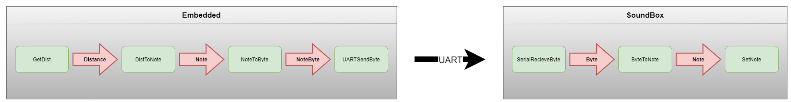

Software Architecture
=====================

This document describes the software architecture of the project. It is split
between what is used by both the embedded and soundbox programs, and then the
specific parts of each program.

Shared
------

As notes shall be communicated between both programs, a common type is defined:
the `Notes` type is an enumerated type, holding all the possible values a note
produced by our program can have.

The `NoteToString` function allows translation of a `Notes` to a `String`.

Embedded
--------

A `Distance` type is defined as a range of 1-digit mantissa `Float` from `2.0` to `400.0`, corresponding to the distances the HC-SR04 sensor can measure.

A `DistanceToNote` function allows translation of a `Distance` into a `Notes`.

The embedded codebase defines a `Sonar` record representing the HC-SR04 sensor.
It is instantiated using identifiers of the board's GPIOs connected to the sensor's `Trigger (PE6)` and `Echo (PE4)` pins, and defines a `GetDistance` method which returns an `Integer` representing the distance in centimeters detected by the
sensor.

A `Note_Byte` type is defined, representing a serialized note on one byte. The
`Note_To_Byte` function serializes the given `Notes` into a `Note_Byte`.

The `UART_Send_Byte` function sends the given byte on the given `UART TX (PD6)` pin. The `UART RX (PD5)` pin is also defined but not used as the embedded software is emit only.

The `Main` loop waits for a button press, stores the result of `GetDistance`,
computes and stores the corresponding note using `DistanceToNote`, converts the
result using `Note_To_Byte`, then calls `UART_Send_Byte` on this byte.

Soundbox
--------

The `Serial_Receive_Byte` function blocks until receiving one single byte from
the channel connected to the board's UART, then returns it.

A `Note_Byte` type is defined like the one in embedded, but not a subtype of
the same type (`UInt8` for `embedded`, `Stream_Element` here). The
`Byte_To_Note` function deserializes the given `Note_Byte` into a `Notes`.

The `PollFrequency` function shall poll a sound-wave at the given frequency on
the audio stream for a duration of one second.

The `Main` loop calls `Serial_Receive_Byte`, then calls `Byte_To_Note` on the
result and stores the obtained note, then shall compute the corresponding
frequency using `NoteToFrequency`, then call `PollFrequency` on the result.
